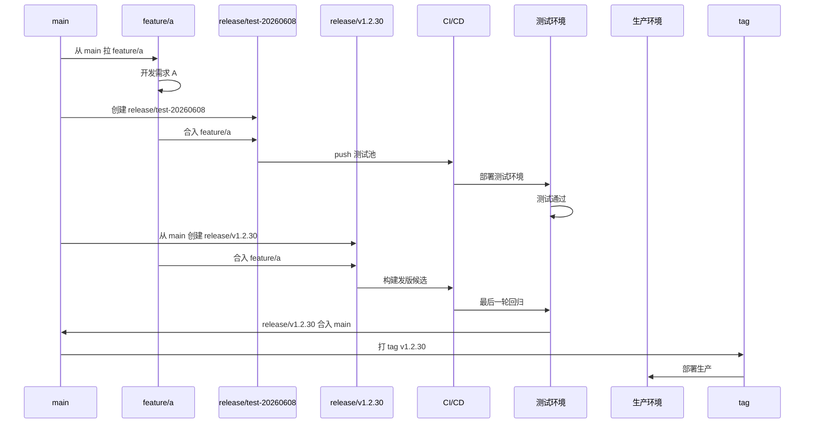
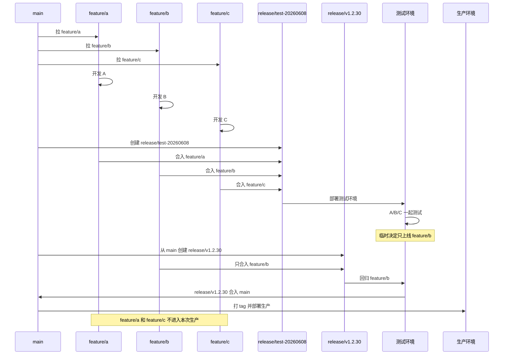
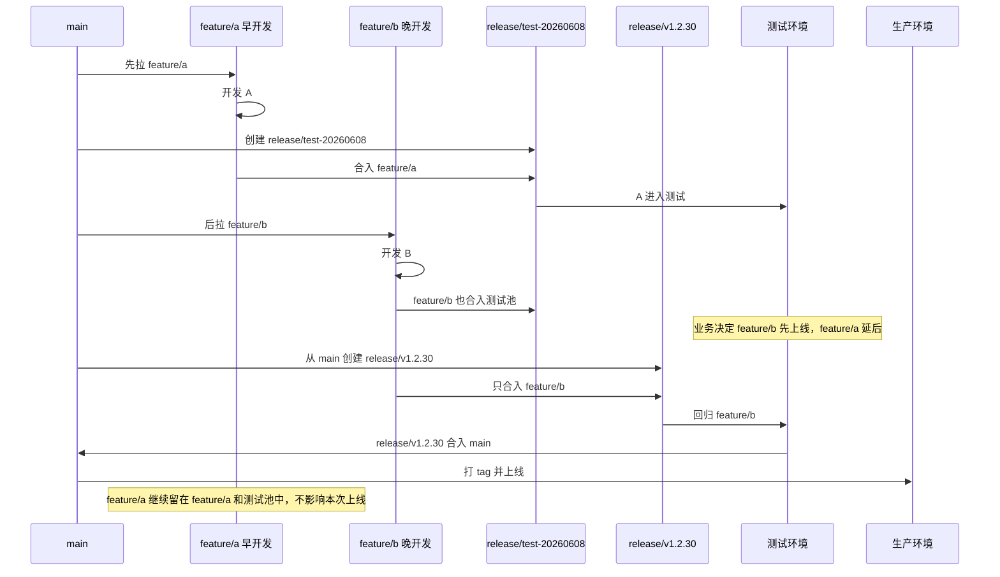
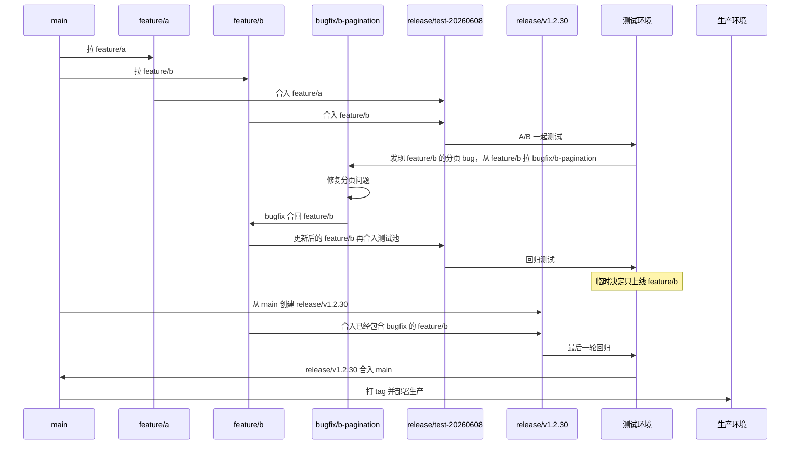
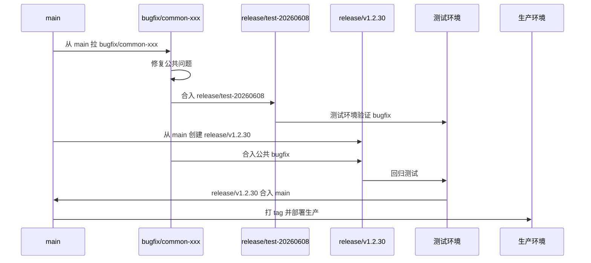
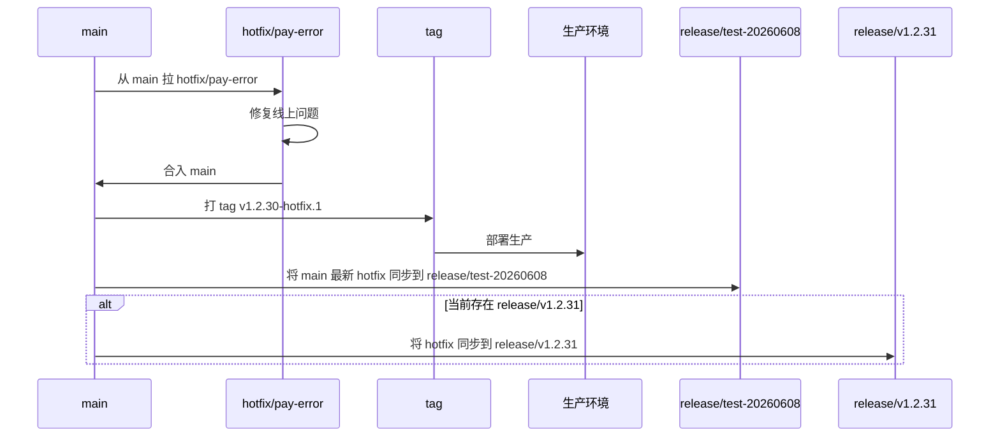
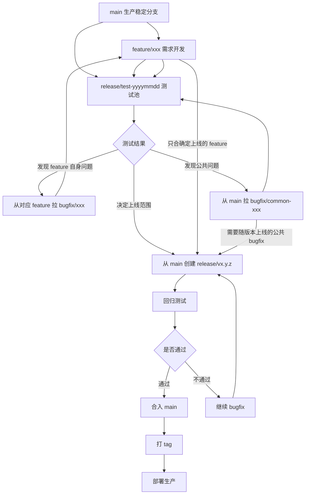

# 多 Feature 并行测试下的 GitFlow 分支管理方案

## 一、背景

在实际业务开发中，传统 GitFlow 往往只考虑比较理想的发布流程：

```txt
main -> feature/xxx -> release/xxx -> main
```

但在真实项目中，经常会出现更复杂的情况：

* 多个 `feature` 同时进入测试；
* 晚开发的 `feature` 反而要先上线；
* `release` 分支里正在测试多个需求，但最后只决定上线其中一个；
* 测试阶段发现 bug，需要判断这个 bug 是属于某个 feature，还是属于公共问题；
* 测试期间修复的 `bugfix`，最后要确保能跟随对应的 feature 一起上线；
* 希望团队流程统一，不要有时使用 `release/test-xx`，有时又不用。

因此，如果仍然只使用：

```txt
main
feature/xxx
hotfix/xxx
release/xxx
```

会比较容易出现几个问题：

1. `release` 分支混入多个 feature 后，不知道最终哪些代码会进入生产；
2. 临时只上线其中一个 feature 时，很难从已有 release 中剥离其他 feature；
3. 测试期间修复的 bugfix 容易只存在于 release 分支，最终正式发版时被遗漏；
4. 流程不统一，团队成员理解成本较高。

为了解决这些问题，建议在现有 GitFlow 基础上增加 `bugfix/xxx` 分支，并将 `release` 分为两类：

```txt
release/test-yyyymmdd
release/vx.y.z
```

---

## 二、推荐分支模型

最终推荐的分支结构如下：

```txt
main
feature/xxx
bugfix/xxx
hotfix/xxx
release/test-yyyymmdd
release/vx.y.z
```

各分支职责如下：

| 分支                      | 作用                      | 是否允许进生产          |
| ----------------------- | ----------------------- | ---------------- |
| `main`                  | 生产稳定分支，始终代表线上代码         | 是                |
| `feature/xxx`           | 单个需求开发分支                | 否                |
| `bugfix/xxx`            | 测试阶段发现的问题修复             | 否，最终随 release 进入 |
| `hotfix/xxx`            | 线上紧急问题修复                | 是                |
| `release/test-yyyymmdd` | 测试池，可以合入多个 feature 一起测试 | 否                |
| `release/vx.y.z`        | 正式发版候选分支，只包含本次确定上线内容    | 是                |

---

## 三、核心原则

### 1. `release/test-xx` 只是测试池

`release/test-yyyymmdd` 用来承载多个 feature 的集成测试。

例如：

```txt
release/test-20260608
  ├── feature/a
  ├── feature/b
  └── feature/c
```

这个分支可以包含多个候选需求，用来部署测试环境，让测试人员集中验证。

但是它有一个非常重要的限制：

```txt
release/test-xx 不能直接合入 main
release/test-xx 不能直接发生产
```

因为它里面可能包含多个还未确定上线的需求。

---

### 2. `release/vx.y.z` 才是真正的发版候选

真正准备上线时，必须从 `main` 新建正式发版分支：

```txt
main
  └── release/v1.2.30
```

然后只把本次确定上线的 feature 合进去。

例如测试池中有：

```txt
feature/a
feature/b
feature/c
```

最后业务决定只上线 `feature/b`，那么正式发版分支应该这样处理：

```txt
main -> release/v1.2.30
feature/b -> release/v1.2.30
```

不要从 `release/test-20260608` 切出 `release/v1.2.30`，也不要直接把 `release/test-20260608` 合入 `main`。

这样可以保证：

```txt
测试池中可以有 A、B、C
但正式上线时只会带上 B
```

---

### 3. `bugfix` 要跟着对应 feature 走

测试阶段发现 bug 时，第一步不是直接在 `release/test-xx` 上修，而是先判断这个 bug 属于谁。

如果 bug 是某个 feature 自身引入的，例如 `feature/b` 的分页问题，那么应该这样处理：

```txt
feature/b -> bugfix/b-pagination
bugfix/b-pagination -> feature/b
feature/b -> release/test-20260608
```

这样做的好处是：

```txt
bugfix 最终会沉淀回 feature/b
如果最后上线 feature/b，这个 bugfix 会自然跟着上线
```

如果只把 bugfix 修在 `release/test-xx` 上，那么后面从 `main` 重新创建 `release/vx.y.z` 时，很容易漏掉这个修复。

---

### 4. 公共 bugfix 从 main 拉

如果测试阶段发现的问题并不属于某个 feature，而是 `main` 本身就存在的公共问题，那么可以从 `main` 拉出公共 bugfix：

```txt
main -> bugfix/common-xxx
```

修复完成后，根据情况合入测试池和正式发版分支：

```txt
bugfix/common-xxx -> release/test-20260608
bugfix/common-xxx -> release/v1.2.30
```

---

### 5. `hotfix` 只处理线上紧急问题

`bugfix` 和 `hotfix` 要区分清楚：

```txt
bugfix = 测试阶段问题修复
hotfix = 线上紧急问题修复
```

线上问题应该从 `main` 拉出 `hotfix/xxx`：

```txt
main -> hotfix/pay-error
hotfix/pay-error -> main
main -> tag -> production
```

上线完成后，要同步回当前测试池，避免测试环境后续又把老代码带回生产：

```txt
main -> release/test-yyyymmdd
main -> release/vx.y.z
```

---

## 四、标准发版流程

整体流程如下：

```txt
1. 从 main 拉 feature/xxx
2. feature 开发完成后合入 release/test-yyyymmdd 测试池
3. 多个 feature 可以同时进入 release/test-yyyymmdd 测试
4. 测试阶段发现问题，根据归属创建 bugfix
5. 确定上线范围后，从 main 创建 release/vx.y.z
6. 只把本次确定上线的 feature 和 bugfix 合入 release/vx.y.z
7. release/vx.y.z 回归测试通过后合入 main
8. main 打 tag
9. 部署生产
```

---

## 五、场景一：单个 feature 正常测试并上线

适用情况：

```txt
只有一个 feature 准备上线
测试通过后按正常流程发版
```



这个流程的重点是：

```txt
测试用 release/test-xx
上线用 release/vx.y.z
```

即使当前只有一个 feature，也保持统一流程。

---

## 六、场景二：多个 feature 同时测试，最后只上线一个

适用情况：

```txt
release/test-20260608 中同时测试 feature/a、feature/b、feature/c
最后业务决定只上线 feature/b
```

错误做法：

```txt
release/test-20260608 -> main
```

这样会把 `feature/a`、`feature/b`、`feature/c` 全部带上线。

正确做法：

```txt
main -> release/v1.2.30
feature/b -> release/v1.2.30
```



这个场景下，核心原则是：

```txt
release/test-xx 只是测试池
不能代表最终上线范围
```

最终上线范围必须由 `release/vx.y.z` 重新确认。

---

## 七、场景三：晚开发的 feature 先上线

适用情况：

```txt
feature/a 先开发，也先进入测试
feature/b 后开发，但业务决定 feature/b 先上线
```

这种情况很常见。

上线顺序不应该由 feature 创建时间决定，而应该由正式发版分支决定。



判断一个 feature 是否上线，只看它有没有进入正式发版分支：

```txt
进入 release/vx.y.z = 本次准备上线
只在 release/test-xx = 仍然只是测试
```

---

## 八、场景四：测试期间修了 bugfix，最后只上线其中一个 feature

适用情况：

```txt
release/test-20260608 中有 feature/a 和 feature/b
测试时发现 feature/b 有 bug
修复 bugfix/b-pagination
最后决定只上线 feature/b
```

正确处理方式：

```txt
feature/b -> bugfix/b-pagination
bugfix/b-pagination -> feature/b
feature/b -> release/test-20260608
main -> release/v1.2.30
feature/b -> release/v1.2.30
```



这里最关键的是：

```txt
属于 feature/b 的 bugfix，必须合回 feature/b
```

这样 `feature/b` 自身就是完整的，正式发版时只需要合入 `feature/b`，就不会漏掉测试期间的修复。

---

## 九、场景五：测试期间修的是公共 bug

适用情况：

```txt
bug 不是某个 feature 引起的
而是 main 原本就存在的问题
```

这种情况下，应该从 `main` 拉公共 bugfix：

```txt
main -> bugfix/common-xxx
```

然后根据上线范围决定是否进入本次正式版本：



公共 bugfix 是否进入本次发版，要由发版负责人确认。

如果该 bugfix 必须本次上线，就合入 `release/vx.y.z`。

如果不需要本次上线，可以留到下一个版本。

---

## 十、场景六：线上紧急 hotfix

适用情况：

```txt
生产环境出现紧急问题
需要绕过当前测试池，快速修复上线
```

流程如下：



线上 hotfix 完成后，一定要同步到当前测试分支和发版候选分支。

否则后续版本上线时，可能会把线上刚修复的问题覆盖掉。

---

## 十一、整体流程图



---

## 十二、团队落地规范

可以将以下规则写入团队开发规范。

### 1. main 分支

`main` 永远代表生产环境稳定代码。

任何代码进入 `main`，都意味着它已经准备好发布到生产环境。

---

### 2. feature 分支

所有需求开发都从 `main` 拉出独立 feature 分支：

```txt
feature/member-renew
feature/share-page
feature/batch-open-member
```

feature 分支开发完成后，可以合入 `release/test-yyyymmdd` 进行测试。

feature 分支不能直接合入 `main`。

---

### 3. release/test 分支

`release/test-yyyymmdd` 是测试池，用于多个需求的集成测试。

命名示例：

```txt
release/test-20260608
release/test-20260609
```

规则：

```txt
release/test-xx 可以合入多个 feature
release/test-xx 只能部署测试环境
release/test-xx 不能直接合入 main
release/test-xx 不能直接发生产
```

---

### 4. release/v 分支

`release/vx.y.z` 是正式发版候选分支。

命名示例：

```txt
release/v1.2.30
release/v1.2.31
```

规则：

```txt
release/vx.y.z 必须从 main 创建
release/vx.y.z 只允许合入本次确定上线的 feature、bugfix、hotfix 同步代码
release/vx.y.z 测试通过后合入 main
main 打 tag 后部署生产
```

---

### 5. bugfix 分支

`bugfix/xxx` 用于测试阶段问题修复。

如果问题属于某个 feature：

```txt
feature/xxx -> bugfix/xxx
bugfix/xxx -> feature/xxx
feature/xxx -> release/test-xx
```

如果问题属于公共问题：

```txt
main -> bugfix/common-xxx
bugfix/common-xxx -> release/test-xx
bugfix/common-xxx -> release/vx.y.z
```

---

### 6. hotfix 分支

`hotfix/xxx` 用于线上紧急问题修复。

流程：

```txt
main -> hotfix/xxx
hotfix/xxx -> main
main -> tag
tag -> production
main -> release/test-xx
main -> release/vx.y.z
```

hotfix 合入 `main` 后，必须同步到当前测试池和发版候选分支。

---

## 十三、常见问题

### 1. 为什么不能直接把 release/test 合入 main？

因为 `release/test-xx` 可能包含多个 feature，而这些 feature 不一定都会上线。

如果直接合入 `main`，会导致未确认上线的功能被带到生产环境。

---

### 2. 为什么 release/vx.y.z 要从 main 创建？

因为 `main` 是生产稳定分支。

从 `main` 创建正式发版分支，可以保证发版候选分支是干净的，只包含当前生产代码和本次明确要上线的内容。

---

### 3. 如果 feature/a 和 feature/b 都在测试，但只上 feature/b，怎么办？

从 `main` 创建新的正式发版分支：

```txt
main -> release/v1.2.30
feature/b -> release/v1.2.30
```

不要从测试池切正式发版分支。

---

### 4. 如果测试阶段的 bugfix 只修在 release/test 上，会有什么问题？

会导致 bugfix 没有沉淀回 feature 或 main。

后面从 `main` 创建 `release/vx.y.z` 时，这个 bugfix 可能会丢失。

因此，bugfix 必须根据归属合回对应源头：

```txt
feature 问题 -> 合回 feature
公共问题 -> 合回 main 或进入正式 release
```

---

### 5. 晚建的 feature 可以先上线吗？

可以。

上线顺序不看 feature 创建时间，只看它是否进入正式发版分支：

```txt
进入 release/vx.y.z = 本次上线
只在 release/test-xx = 仅测试，不上线
```

---

## 十四、最终结论

对于存在多需求并行、临时调整上线范围、测试阶段频繁修复问题的团队，不建议只使用简单的 GitFlow：

```txt
main
feature/xxx
release/xxx
hotfix/xxx
```

更推荐使用：

```txt
main
feature/xxx
bugfix/xxx
hotfix/xxx
release/test-yyyymmdd
release/vx.y.z
```

核心思想是：

```txt
release/test-xx 是测试池
release/vx.y.z 是正式发版候选
release/vx.y.z 永远从 main 新建
```

只要这个原则稳定执行，就可以解决以下问题：

```txt
多个 feature 同时测试
晚开发的 feature 先上线
测试池里多个需求，最后只上其中一个
测试期间 bugfix 要跟随对应 feature 上线
线上 hotfix 要同步回测试池和发版候选分支
```

这套流程虽然比传统 GitFlow 多了一层 `release/test-xx`，但它能显著降低发版风险，让测试范围和上线范围彻底解耦，更适合中后台、小程序、SaaS 系统等多需求并行开发的项目。
